# [ThunderHawk] DP5 Showcase and Final Report

20190447 Dongseop Lee, 20200096 Seyeon Kim, 20200872 Nuzup Shadiev

---

# Representative Screenshots

1. Create or join a project

   1. Create a project

      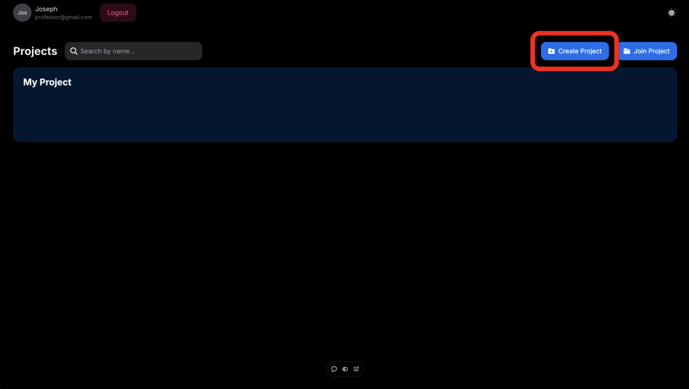

      

   2. Join a project

      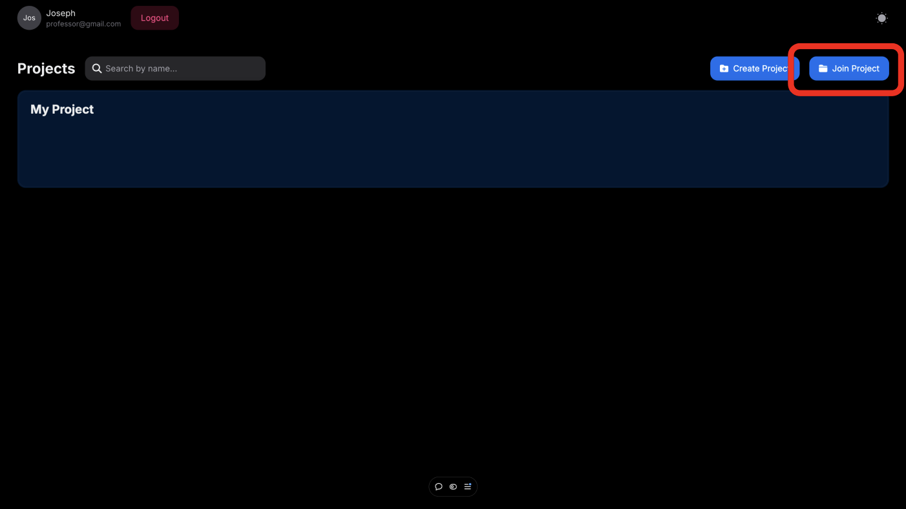

      

      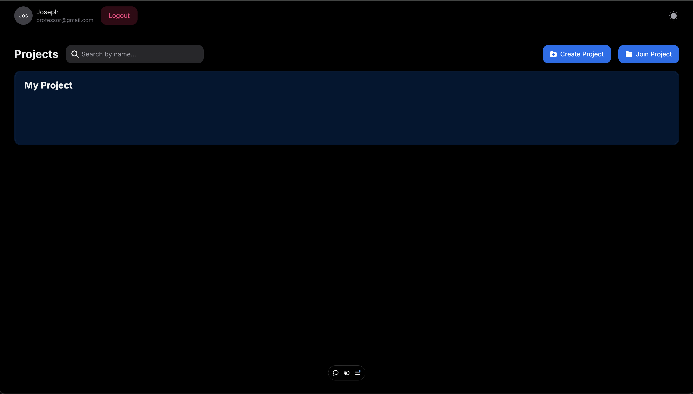

      Click on “join project” button, input your invitation code, and click “join”. You will be automatically added to the project.

2. Upload a new video

   

   Click the “Upload a Video” button to upload a new video.

   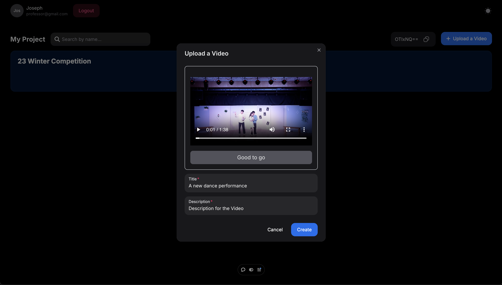

   Click the ”Choose a video to upload” button and choose a video you want to upload. Write the title and description of the video. Click the “Create” button and wait until it is uploaded.

   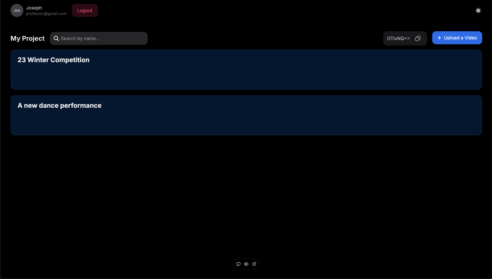

   The video is uploaded.

3. View videos and leave comments

   1. View the video

      

      Click anywhere on the video to play the video.

   2. Leave comments

      

      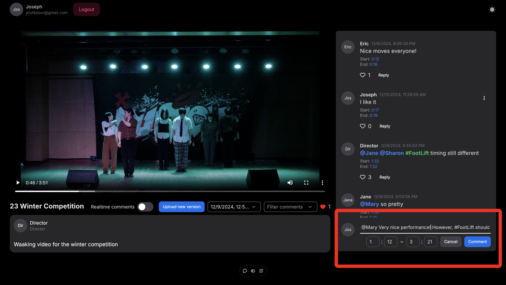

      Click the section that says “Add a public comment…” to add a comment. After you put down specified time and your comments content, press “Comment” button to post you comment.

4. Go to timestamp of the commento timestamp of the comment

   

   Click on the timestamp to go to that part of the comment.

   1. Like comment

   

   Press the heart button to like the comment

   **6. Reply to comment**

   

   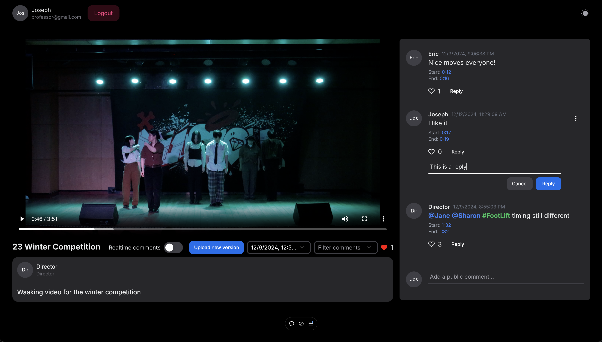

   Click reply and write down your comment to leave a reply to any comment in the comments section.

   1. Filter comments

   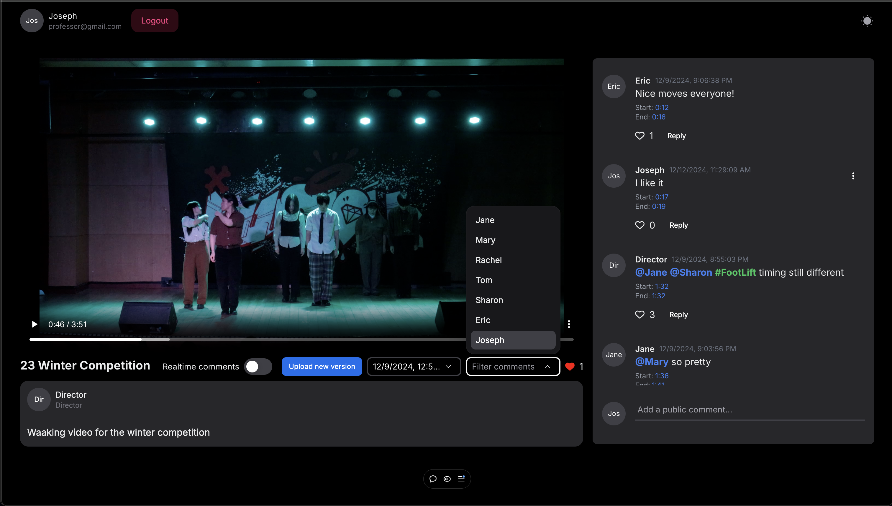

   Click “Filter comments” to filter comments based on people mentioned.

   1. Upload a new version of the video

   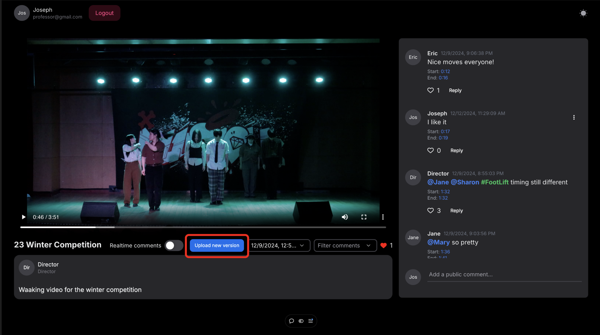

   

   Click “Upload new version” button and input necessary information including new version of your video. Click “Upload” to upload it.

   1. **Switch between versions**

   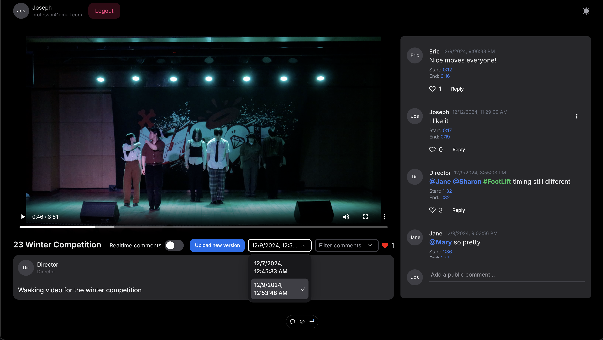

   Click on versions of the video to switch between versions

   1. **Realtime Comments**

   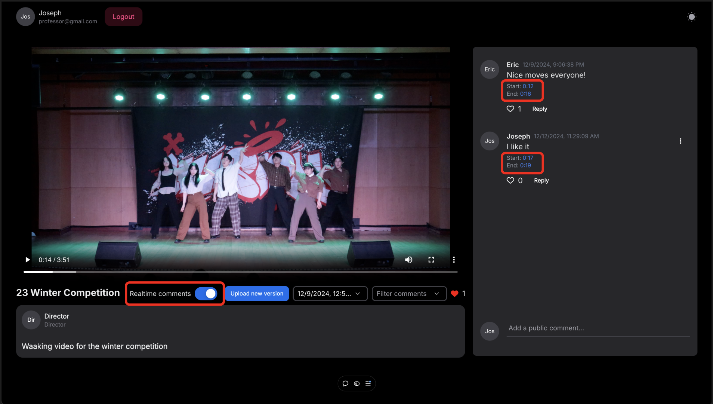

   Toggle “Realtime Comments” on or off to only see comments related to the part of the video you are currently watching.

   1. **Hashtags**

   

   

   Click on any hashtag you want to see and a popup window will appear. In the window, you can select comments including the hashtag and go to the different versions of the video that have the selected hashtag.

# Quality Arguments

Dancehub provides a **private group workspace** for choreography teams. The members of the project are saved so that they can be mentioned when leaving comments. Also, directors can manage the projects with the authority to delete videos and comments. This ensures a secure and organized workspace tailored to choreography teams’ needs.

It is easy to **leave choreography-specific feedback** using Dancehub. The layout is allows users to view the video and leave comments simultaneously. Users can leave timestamped comments to pinpoint specific moments for feedback. Users can mention people by typing “@” to leave feedback to a specific person, or use tags by typing “#” to leave feedback about some recurring moment in the choreography. This helps users convey their feedback more clearly and prevent misunderstandings. We also provide real-time toggle so that users can view comments related to the current scene allowing users to avoid overlapping feedback. They can simply like the comments to show agreement on that comment or add a reply to the comment. A user mentioned, “While other platforms such as YouTube provide timestamps as well, this website provides the real-time comments too, which makes it much easier to follow along with the comments during the video. That's the part I liked the most.”

It is easy to view feedback using Dancehub. Users can click timestamps to navigate directly to relevant video sections and use real-time toggles to focus on comments related to the current scene. The comment filter allows users to view comments for a specific person. Many users mentioned that they liked this function and would be very helpful for choreography. Clicking on tags will show users all the comments containing that tag and redirect them to that part of the video. This lets users acknowledge recurring mistakes and follow up from previous videos.

# Deployment Summary

We distributed a google survey containing information on what the user test is for, how to set up, and 5 main tasks followed by questions asking how easy the site was to use, whether it was fit for choreography and other opinions about our website. The 5 main tasks were about viewing a video, leaving comments, liking and filtering comments, and using the tag feature.
There were 14 participants in total, all who have experience in directing or performing in choreography teams. The result of the deployment can be divided into three parts. How easy was it? Is it fit for choreography? And some overall impressions and additional suggestions. Small numbers are positive reactions and large numbers are negative reactions in the following graphs.

How easy was it?
Most users found it relatively easy to use the website. However, some people found I confusing to find the comment filter and use the tag functions. We believe some more thoughts will be needed for better heuristics for these functions.

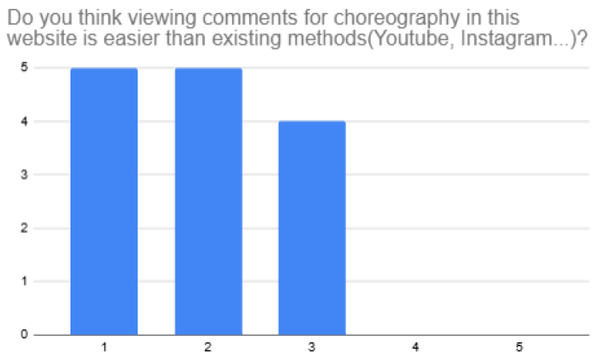
Fit for choreography?
Many people thought that the website was fit for choreography. Many people mentioned that our main features such as real-time toggle, mention filters, tags, and timestamps would be very helpful for choreography.
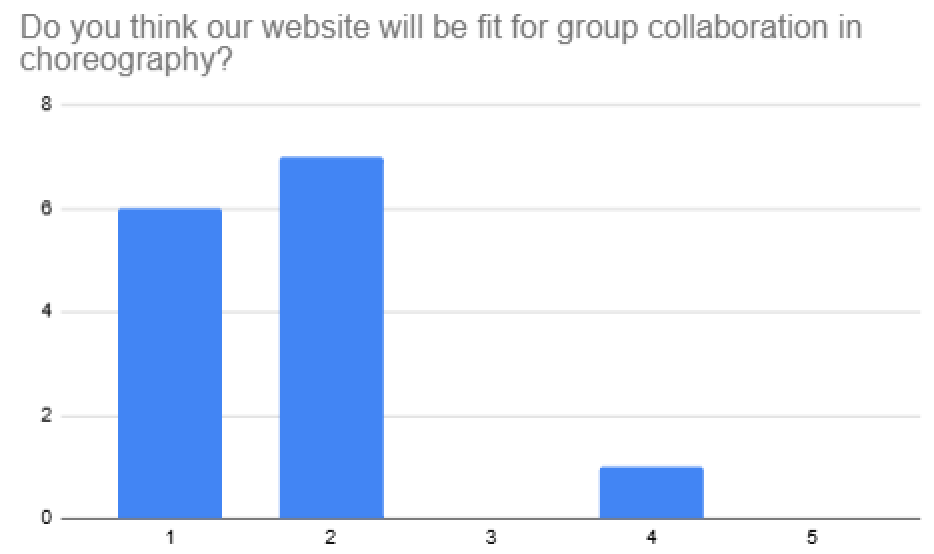
The overall impression was that they liked the main functions in our website. There were some suggestions to improve the website. For example, some users expressed complaint about having to manually input the time for timestamps. Some users suggested additional features such as checkboxes for feedback that is applied and resolved.

# Discussion

### Leverage social computing

Our purpose is making a type of structure for communication in choreography with leveraging social computing. It has three main effects on collaboration in choreography.
First, our project creates a new site for communication that **makes up the defects of offline communication**. Offline communication on choreography is usually done by the director of the project. In this case, only active peformers' idea is admitted. However, webpage makes a new site for communication, which makes all suggestions possible with less pressure than in offline communication. Therefore, a choreography team can make use each member's creativity and collaborative intelligence more easily.
Second, our application serves a **common memory device** of a team. Many choreography team suffers from managing the versions of the video, archiving each feedback, and check the progress over time. Our application combines these process into one seamless flow by enabling them in one screen. This also helps coordination among members. Every communication is operated on the common knowledge base. Members can optimize the coordination process with archived data of prior communication and performance videos.
Third, we provide a **structured way of collaborative work process especially in choreography**. Collaboration process in a choreography team consists of two main parts: individual practice and group practice. Using mention feature, a member can specify that a comment is for an individual, not for the whole team. Then, he/she can filter out comments for only him/herself. This process divides individual work and collaborative one by helping members only focus on the feedbacks for each of them. Meanwhile, Tag feature provides another way of grouping comments. Conceptually grouped comments have more power than scattered ones to help individuals improve their performance.

### Identity & Relationships

There are two kinds of identity: **Director**(moderator, project owner) and **Member**. In a project, everyone has the same opportunity of remark. But we thought there should be a moderator. A director can choose to delete comments to prevent bad behaviors and create the atmosphere he/she desire. One another consideration is not emphasizing a director's comment. We worried it can cereate unseen gap between director's comment and a normal member's one. That's not what we expected.

### Anonimity level

Our first consideration was **anonimity v.s identifiability**. With using anonimity, we expected to get more creative idea. However, we concluded that everyone should be identifiable to guide members to make meaningful communication. We were afraid that anonimity harms to overall communication quality and make proper moderation harder. And anonimity has a possibility that reduce the effect of mention feature.

### Reaction

One of our concern was about using **like/unlike button**. Through both of the reaction buttons, users can express their preference in an easy way. However, it can have a bad effect on communication. Just clicking like/unlike button does not have any further explanation about why they like or don't like it. Especially, negative reaction without enough explanation could depress the users to express their idea. That's why we choose to use only like button.

# Individual Reflection

## Dongseop Lee

Until the start of implementation, we've done almost every work together(e.g. writing reports, communications, ideation, ...) For the development, I designed the backend logic and implemented the backend server. Designing backend logic contains building database, defining the relationships among tables, and overall logic of the backend process. And implementing part is mainly about constructing the actual mechanism of backend server. Through this work, I provided a intuitively-structured api server for the request from frontend. Due to the nature of connectivity of backend and frontend, I closely communicated with frontend developer.

During the project, the most thing I liked about our team was close communication. Especially for the development, there should be errors that are not expected. Close real-time communication among members worked when we smoothly collaborate to build frontend and backend concurrently. Also, continuous feedback also helped us not to miss the bugs. The main challenge was scheduling meetings. Everyone had their schedule everyday, so we should meet usually in short. But it was fine because we kept in touch when working individually.

I learned a lot through the project personally. I have never deployed a web service before. So the experience of deploying web application and watching how users interact was so encouraging and interesting. And collaborating in a project, I could recognize the importance of communication and the documents as a communication methods. Especially, api document worked so well to communicate with other team members as a backend developer. With our team members, I could understand the essence of technologies I learned in context of collaborative work.

## Seyeon Kim

I was responsible for making key design decisions for our website. I determined the crucial features and defined their functionality in detail. Additionally, I led the user testing process, deciding on the deployment methods, the features to test, and the questions to ask users during the evaluation.

Our team benefited from each member’s unique strengths, making it easy to divide tasks effectively. Everyone contributed their part excellently. However, we did face some communication challenges. Certain functionalities were not clearly defined, leading to misinterpretations. There was also confusion about whether some features should be implemented on the frontend or backend. Despite these issues, we resolved them through regular meetings and open communication.

This project allowed me to gain valuable experience in collaborative teamwork to develop a fully functional website. It was an enriching process to think critically about the features that would best address user needs and bring them to life through implementation. None of this would have been possible without my incredible teammates, who made the experience both productive and memorable.

## Nuzup Shadiev

In the project, I contributed to the frontend, mostly working on the user interface and integrating it with the database. The platform enables dancers to collaborate effectively with features such as timestamped comments, video versioning, hashtags, mentions, and filters for streamlined communication. My work ensured these functionalities were intuitive and visually appealing, enhancing collaboration among users.

This project was a very valuable exercise in applying the concepts of the Social Computing course. Features such as mentions and hashtags furthered my understanding of supporting social interaction and encouraging user engagement. I also gained insight into privacy considerations and ethical design, ensuring responsible data handling while fostering collaboration.

Teamwork had its challenges, like balancing responsibilities and meeting deadlines, but these were overcome through clear communication and prioritization of tasks. This taught me the importance of adaptability and effective collaboration-lessons I will carry forward in life.

This experience greatly enriched my skills in frontend development, especially in user-oriented interface development, and provided insight into how to incorporate users' feedback. These lessons deepened my understanding of social computing and will be very useful in my future projects.
