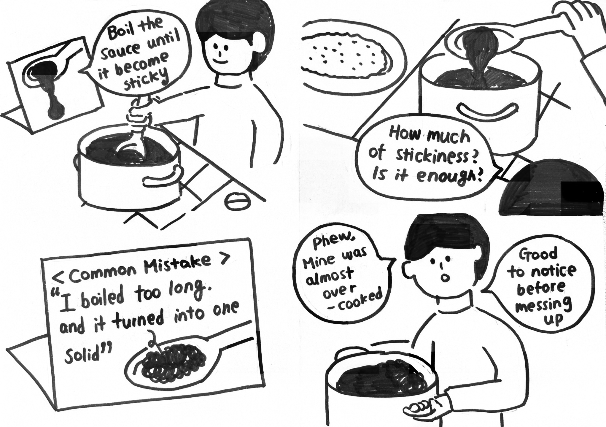
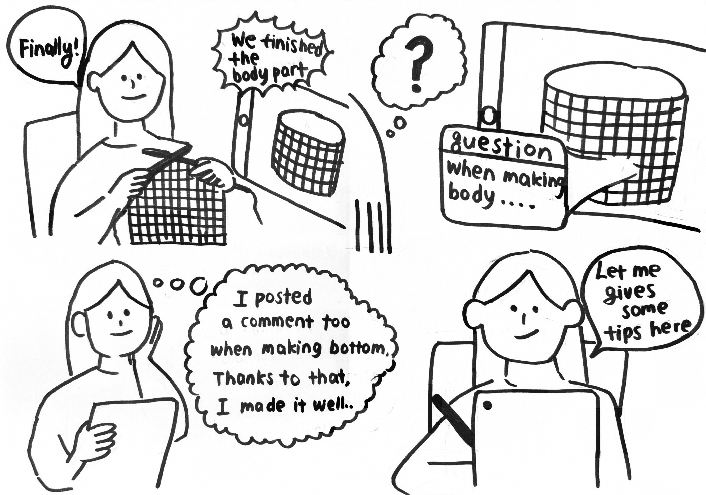

# Studio1 Report

> Team Name : **TutoSupport**
Team Members: Hyewon Lee(20200529), Hyun A Kim (20210830), Sheikh Shafayat (20200873)
> 

# Problem Statement

---

Learners following video tutorials for physical tasks struggle with *excessive manual effort and cognitive load*, hindering effective skill acquisition and task completion.

# Problem Background

---

Tutorials for physical tasks have been researched broadly in terms of sense-making for skill acquisition and task completion [(Endow, 2021)](https://dl.acm.org/doi/pdf/10.1145/3461778.3462066). Physical tasks including cooking, handcrafting, playing instruments, etc are different from other types of learning such as conceptual learning. Tacit skills required for tasks are difficult to verbalize or visualize and various creative approaches may exist on same task (Sennett, Richard. (2008). The Craftsman). Because of these characteristics, learners following video tutorials for physicals tasks often encounter some pain points inducing excessive manual effort and cognitive load as addressed in [Figure1]. Since it is impossible to cover all spectrum of users, we observed that people easily get lost while following the video tutorials and ask for help to others ([Figure2]). To solve the problem, many other tutorial mediums are continuously evolving, but still they are domain-specific and unable to offer the full experience of creative practice [(Endow, 2021)](https://dl.acm.org/doi/pdf/10.1145/3461778.3462066). As a result, we think the problems that users suffer while following existing video tutorials is an important and valuable topic to look into.

![[Figure 1] Problem scenario from internal investigation](./images/image.png)

[Figure 1] Problem scenario from internal investigation

![[Figure 2] Example comments asking for help or providing tips from a knitting tutorial <**How To Knit a Chunky Sweater | Beginner Friendly Step by Step DIY Tutorial,** [https://www.youtube.com/watch?v=GaAHOpJZ5zs](https://www.youtube.com/watch?v=GaAHOpJZ5zs)>](./images/image%201.png)

[Figure 2] Example comments asking for help or providing tips from a knitting tutorial <**How To Knit a Chunky Sweater | Beginner Friendly Step by Step DIY Tutorial,** [https://www.youtube.com/watch?v=GaAHOpJZ5zs](https://www.youtube.com/watch?v=GaAHOpJZ5zs)>

# Motivation

---

Due to their specific requirements, learning physical tasks is an inherently social activity, wherein the expert brings new initiates “*into the know*”. Thus, physical tasks are predominantly taught through apprenticeship, where the learner observes, mimics, and receives tailored feedback from the master. However, apprenticeship is becoming less common over time ([Gamble, 2001](https://eric.ed.gov/?id=EJ638669)), while being an unnecessarily large commitment for hobbyists. Online, the number of learners vastly outnumber experts, making it difficult for experts to personalize feedback for each learner. **In this case, community support can supplement the absence of an expert.** In YouTube tutorial videos, comments often provide feedback and fill learners in with implicit tacit knowledge([Figure 2]). The experiences, mistakes, and feedback coming from other learners at a similar level and situation can imitate the personalized feedback of experts. In addition, the social support provided by a community can encourage learners. However, existing video tutorials consisting of video, description, and comments do not support this sort of social interaction. Thus, we thought that fully incorporating social interaction into video tutorials of physical tasks may aid users in achieving their goals.

# How Might We Questions

---

### **Selection Process**

We each arrived separately at HMW questions that we voted upon to make a list of HMW questions we thought to be the best.

### **HMW Questions**

1. How might we make physical tutorials easier to follow through better guidance?
2. How might we make it easy for the users to find answers to the specific queries they have? 
3. How might we create a platform that allows users to easily share their current situation and get tailored advice? 
4. How might we facilitate peer-to-peer support for users working on similar physical tasks?
5. How might we provide real-time feedback for people following tutorials? 
6. How might we help the user recognize when they are doing something wrong?  
7. How might we make the process of obtaining feedback more enjoyable / educational? 
8. How might we incentivize the process of providing feedback?
9. How might we ensure that users are engaging with tutorials appropriate for their skill level?
10. How might we allow users to adapt tutorials to better suit their skill levels and situations?
11. How might we improve communication between beginners and experts for spatial tasks that are hard to verbalize?

### **Top 3 HMW Questions**

1. How might we facilitate peer-to-peer support for users working on similar physical tasks?
2. How might we help the user recognize when they are doing something wrong? 
3. How might we incentivize the process of providing feedback?

# Solution Ideas

---

### HMW 1: **How might we facilitate peer-to-peer support for users working on similar physical tasks?**

1. Designing a contribution board on top of the video platform that archives people’s unique experiences (e.g. variations, tips, trial-and-error) of following the tutorials 
2. Having a visualized timestamp-based comment system where people can find certain existing comments on certain video-context easily and quickly.
    1. Hovering over a timestamp will show the most popular questions that have been asked.
3. Gathering people in a real-time chat or video calling system to work on the same tutorial at the same time, thus facilitating further collaboration.
4. **Citation system allowing users to see variations upon the content they are watching.** This will be like a recommendation system that looks like a research rabbit. 
5. Letting people privately message each other so that they can become friends with those solving similar problems. There may be a separate community board for looking for peers.
6. Grouping user comments into specific subfields of interest like `#no_oven` or `#vegan` to aid users finding specific questions. Subfields may be set using the user profile.

### HMW 2: **How might we help the user recognize and overcome their mistakes?**

1. Collecting interaction information from people who have followed the tutorial. This will be used to provide visual indicators for the more error-prone stages of the tutorial.
2. Collecting the intermediate output images/videos from users to create a progress board so that people can refer to them and get inspiration. This is very helpful for tasks that require a long-term commitment, like crocheting. 
3. **Community-driven “List of Common Mistakes” showing where others have failed.**
4. Helping users not be afraid of making mistakes by celebrating mistakes: having a board just for people to show off their mistakes (e.g. “Crochet Gone Wrong”). 
5. Recommending supplementary material for overcoming mistakes, possibly when user interaction data indicates user being stuck.

### HMW 3: **How might we incentivize the process of providing feedback?**

1. If the user gives certain feedback, the user will be prompted to answer similar questions.
2. **If user completes a certain step of the tutorial, the user will be prompted to help answer questions pertaining to that step.** This could be triggered by the user explicitly sharing their progress or based on the user’s video interaction logs.
3. Making it easy to write feedback by using autocomplete or linking to other answers that are similar, thus preventing repetitive comments.
4. Classifying questions into clear categories/skill levels so it is easier to find questions and get help. This also makes answering comments easier.
5. Providing strong incentives for providing helpful feedback which comes in the form of badges, hall of fame, awards, special moderator access, etc.

### **Top 3 Solution Ideas Overall**

1. Citation system allowing users to see variations upon the content they are watching.
2. Community-driven “List of Common Mistakes” showing where others have failed.
3. If user completes a certain step of the tutorial, the user will be prompted to help answer questions pertaining to that step.

# Storyboards

---

### **Storyboard 1: <**Citation system allowing users to see variations upon the content they are watching>

### **Storyboard 2:** <Community-driven “List of Common Mistakes” showing where others have failed>

### **Storyboard 3:** <If user completes a certain step of the tutorial, prompting them to help answer questions pertaining to that step>

